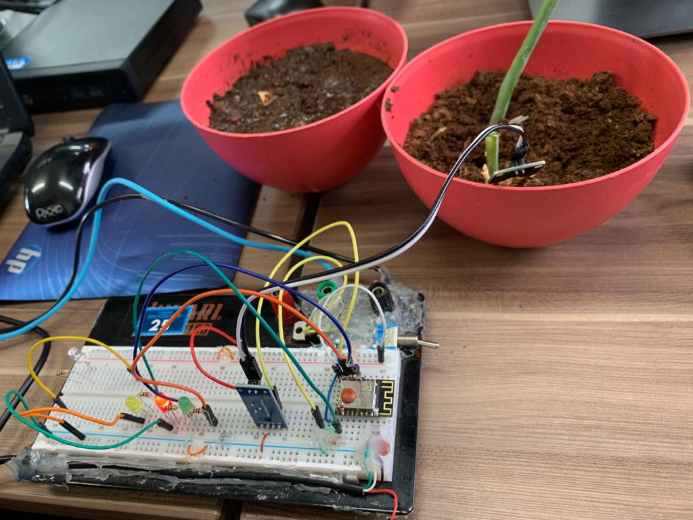

# Me Regue IoT


[pt-br]

## O Projeto



É indispensável saber a condição de quantidade de água no solo, essa umidade influencia em construções, plantações e até mesmo na irrigação de um jardim, mas como a umidade do solo costuma oscilar, precisamos efetuar medições constantes nesse meio. Pensando nisso criamos o projeto que consiste em verificar a partir de determinado solo  sua umidade através de um sensor conectado a uma protoboard.

A partir da análise de dados o sensor colhe as informações e usa o ThingSpeak para armazenar os dados em forma de gráfico a partir delas, gerando uma notificação que é enviada pelo Twitter.

### Foram utilizados no experimento: 

- ESP12
- Sensor de Umidade de Solo e Terra Higrômetro
- Protoboard
- LEDs;
- Resistores;
- Jumpers.

## Funcionamento

O sensor de umidade do solo consiste em 2 partes: uma sonda que entra em contato com solo que junto com o ESP12 processa os dados colhidos e manda para a internet. No sensor as suas saídas consistem em um pino D0(saída digital TTL) que fica no nível 1 ou 0 dependendo da umidade.

A tensão de entrada é entre 3.3V e 5V sendo a corrente de entrada igual a 35 mA. Além disso, colocamos três leds na protoboard. O led da cor vermelha indica que não possui umidade no solo, ao contrário do led verde que aponta umidade no solo e por fim o led amarelo indica o envio da notificação para o Twitter informando a situação atual da planta.
Usamos a ferramenta ThingSpeak para armazenar os dados de entrada a partir do solo verificado. A ferramenta ainda nos possibilita a recuperação desses dados por requisições HTTP, e em casos em que o solo está com umidade baixa notifica por meio de um tweet. 


## Cálculo da Umidade do Solo

Quanto maior o numero lido do ADC, menor a umidad. Sendo assim, calcula-se a porcentagem de umidade por:
```     
Valor lido                 Umidade percentual
  _    0                           _ 100
  |                                |   
  |                                |   
  -   ValorADC                     - UmidadePercentual 
  |                                |   
  |                                |   
 _|_  978                         _|_ 0
```

`UmidadePercentual-0) / (100-0)  =  (ValorADC - 978) / (-978)`

Logo:

`UmidadePercentual = 100 * ((978-ValorADC) / 978)`
